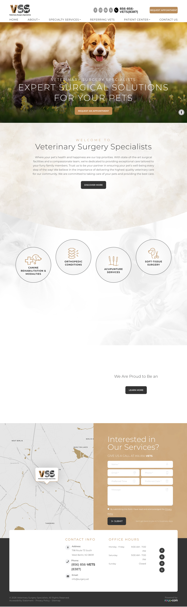
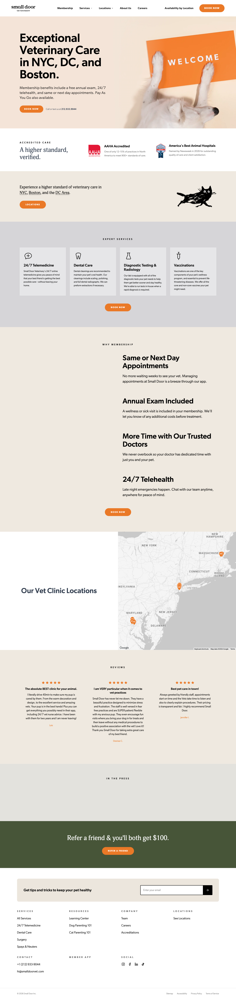
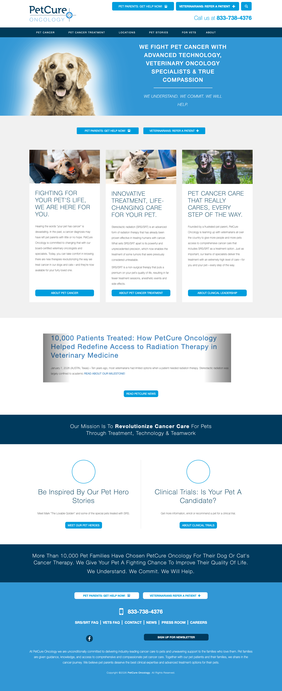
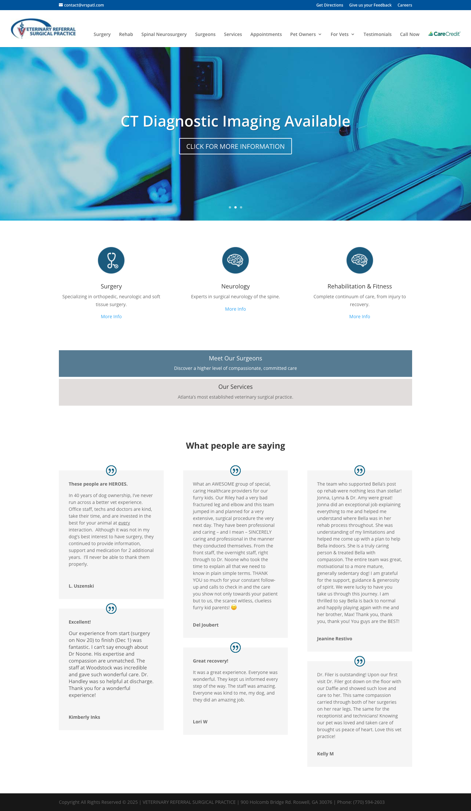
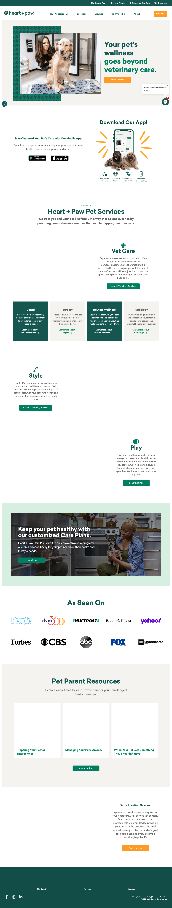
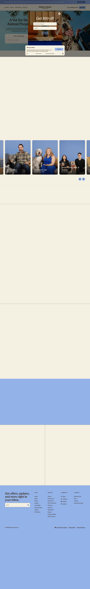

# surgery.vet redesign — visual reference moodboard

Full-page screenshots captured 2026-06-29 (desktop 1440px). Open the PNGs in this folder side-by-side.

---

## 00 · Current surgery.vet (the "before")

**What it is:** Roya.com template. Gold/tan + charcoal palette, watercolor washes, full-bleed corgi+cat hero with **uppercase letter-spaced** overlay text, four **circular line-icon** service nodes, a broken "We Are Proud to Be an [ACVS]" badge, and a contact **form** (no real online booking).

**Gaps to fix:** dated typography, generic template feel, no referring-vet pathway on the homepage, no named board-certified surgeon credentials/storytelling, no real booking flow, no outcome/review proof.

---

## 01 · Small Door — ⭐ AESTHETIC ANCHOR

**Borrow the look:** warm cream/white canvas · one bold dark headline face · a **single orange accent** reserved for CTAs · the emotionally resonant single-photo hero (dog peeking behind the WELCOME sign) · accreditation row (AAHA + "America's Best Animal Hospitals") · clean service cards · reviews with orange stars · restrained footer. A *tokens + photography + cards* concept — clonable at small scale.

## 02 · PetCure Oncology — ⭐ REFERRAL IA + TRUST SPINE

**Borrow the structure:** dual-audience split nav (Pet Owners vs. Referring Vets), mission-driven hero, milestone-stat trust band ("10,000+ patients"), founding-story narrative, education/blog infrastructure. *Caveat: their referring-vet subpages 404 — build yours deep and working.*

## 03 · VRSP — ⭐ REFERRAL TOOLKIT (direct surgery-referral peer)

**Borrow the mechanics:** the "For Vets" toolkit — online referral form + downloadable/fax fallback + **CE/webinar library** + named-surgeon credentialing. The clearest peer template for the referral path. *(Visual design is weak — take content/IA only.)*

## 04 · Heart + Paw — graphic-motif device

**Borrow one idea:** a single ownable graphic motif (their geometric tile behind the hero) — the device that lifts a site above templates. Use an anatomical/surgical line motif sparingly.

## 05 · Modern Animal — quantitative trust signals

**Borrow one idea:** specific, quantitative trust signals (exact per-platform review counts, named testimonials) instead of vague praise.

---

### The synthesized concept
**Small Door's aesthetic** + **PetCure's dual-audience referral IA** + **VRSP's referral toolkit** + Heart+Paw's signature motif + Modern Animal's quantified trust = a calm, premium, *specialist-surgical referral destination* that serves pet owners AND referring DVMs.
